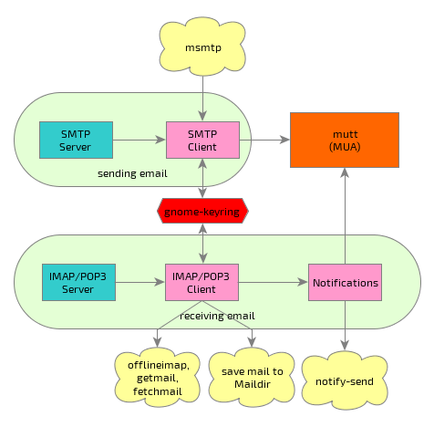

Mutt + OfflineIMAP + Msmtp = Email client
=========================================



## Get things:

```bash
# install essential software from ubuntu package manager
sudo apt-get install mutt mutt-patched msmtp seahorse libsecret-tools gpicview abook urlview mairix abook offlineimap

# install keyring for python to get password from gnome-keyring
sudo pip2 install keyring
```

## Config things:

- If you want to convert from Gmail contact

```bash
# get vcard2abook to convert vcard to abook
wget https://raw.github.com/yaroot/scripts/master/vcard2abook.py
python3 vcard2abook.py  -f /data/Downloads/contacts.vcf -o /data/Dropbox/Docs/Private/Contacts/abook
```

- Get config file and edit as you wish

```bash
# Clone mine
git clone https://bitbucket.org/manhtai/mutt-config ~/.mutt
cd ~/.mutt

# Config your imap account
vim offlineimaprc

# Config your mutt
vim muttrc

# Config your smtp account
vim msmtprc

# Config you abook
vim abookrc
```

## Run things:

```bash
# Download all mail to your computer
offlineimap

# Index mail for searching
mairix -v

# Read and send your mail!
mutt
```

## Fix somethings:

```bash
# chmod for msmtprc if got permission error
chmod 600 ~/.mutt/msmtprc

# You got any?
```

## Reference:

[Here][1], [here][2] and [here][3].

[1]: https://www.proteansec.com/linux/the-ultimate-guide-to-mutt/
[2]: http://stevelosh.com/blog/2012/10/the-homely-mutt
[3]: http://www.google.com

